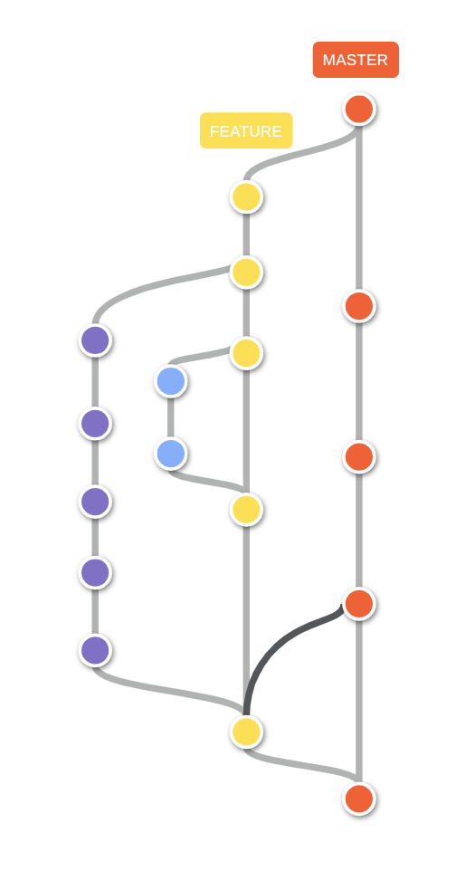

# Komatsu Ope Backnd App

App for the Komatsu Ope project: https://sites.google.com/d/1zgwuCiW6mvVOJxWbaNjp_7CPBI9jWtiW/p/1IvCEpuosL_Dgqa1KqRAdNqfRU8DQKUt1/edit?pli=1

## Architecture

- [Project Structure](./docs/project-structure.md)

## Features

Here are some of the features that we have added in the starter kit.

| Feature                  | Info               | Progress |
| ------------------------ | ------------------ | -------- |
| Authentication           | JWT                | Done     |
| Authorization            | RBAC (Role based)  | Done     |
| ORM Integration          | TypeORM            | Done     |
| DB Migrations            | TypeORM            | Done     |
| Logging                  | winston            | Done     |
| Request Validation       | class-validator    | Done     |
| Pagination               | SQL offset & limit | Done     |
| Docker Ready             | Dockerfile         | Done     |
| Auto-generated OpenAPI   | -                  | Done     |
| Auto-generated ChangeLog | -                  | WIP      |

Apart from these features above, our start-kit comes loaded with a bunch of minor awesomeness like prettier integration, commit-linting husky hooks, package import sorting, docker-compose for database dependencies.

## Installation

Note: when using docker, all the `npm` commands can also be performed using `./scripts/npm` (for example `./scripts/npm install`).
This script allows you to run the same commands inside the same environment and versions than the service, without relying on what is installed on the host.

```bash
$ npm install
```

## Running the app

We can run the project with or without docker.

### Local

To run the server without Docker we need this pre-requisite:

- Database server is running, and can be accessed.
- Parameters in .env file has been set including db info and jwt info.

Commands:

```bash
# development
$ npm run start

# watch mode
$ npm run start:dev

# production mode
$ npm run start:prod
```

### Azure Web App

We can configure CI/CD in an Azure Web App. It creates workflow files under `.github/workflows`. </br>
After pushing to Github, GitHub Action will be triggered to read the `Dockerfile` and build image then push to Azure Container Repository.

### Docker

```bash
# build image
$ docker build -t my-app .

# run container from image
$ docker run -p 3000:3000 --volume 'pwd':/usr/src/app --network --env-file .env my-app

# run using docker compose
$ docker compose up
```

Learn more about Docker conventions [here](https://github.com/monstar-lab-group/nodejs-backend/blob/master/architecture/docker-ready.md). (WIP - Currently this is an internal org link.)

## Test

```bash
# unit tests
$ npm run test

# e2e tests
$ npm run test:e2e

# test coverage
$ npm run test:cov
```

## Endpoints

### Swagger

Swagger have been integrated, we can access it via below url: </br>
`https://{domain_name}/swagger`

### Other endpoints

Endpoints are started from `/v1`, e.g., </br>
`https://{domain_name}/v1/health-check`

## How to do authentication checks

See: https://kmt-mlb.atlassian.net/wiki/spaces/SD/pages/4161571/FE+BE

### How it works

We use `@nestjs/jwt` and `jwks-rsa` to validate access token.

See: [auth.guard.ts](./src/shared/guards/auth.guard.ts)

## How to do authorization checks

See: [permission.interceptor.ts](./src/shared/interceptors/permission.interceptor.ts)

## Code Review Guidelines

- Follow the standard code style guidelines: https://github.com/felixge/node-style-guide
- When creating a new Pull Request (PR) make sure of the following before submitting a review:
  - The system will continue to work well for its users and developers after the PR is merged. No black screens, no crashes.
  - UI displays correctly as expected.
  - Automated checks are passing and there are no issues.
- The submitter will send the PR to the owner of the code. If the owner is the same submitter, the review will be done by the Tech Lead.
- Always use the PR template: [https://github.com/monstar-lab-consulting/kmt-ope-api-nest-js/blob/main/.github/pull-request-template.md](https://github.com/monstar-lab-consulting/kmt-ope-api-nest-js/blob/main/.github/pull-request-template.md)
  - Don’t modify the structure.
  - Properly fill all sections and don’t leave any empty fields.
- Write a clear and concise PR description
- Add PR comments when necessary to clearly understand the context or a code line out of place.
- Make things easy to the reviewer.
- Let's try to write short PRs as much as possible, don't mind one line changes PRs.

To understand the above guidelines please take a look at:

- English: [https://docs.google.com/presentation/d/1alaJ52-W6ANLEkAUZVjmf7dCN3V7WY6BweKsYCEuZvo](https://docs.google.com/presentation/d/1alaJ52-W6ANLEkAUZVjmf7dCN3V7WY6BweKsYCEuZvo)
- Vietnamese: [https://docs.google.com/presentation/d/1mvn2gLMY170mJUkFfsI8XhHjEmwWhWy0vvHlenXtKgY](https://docs.google.com/presentation/d/1mvn2gLMY170mJUkFfsI8XhHjEmwWhWy0vvHlenXtKgY)

## Commit check

We use commitlink to check if git commit messages meet the [conventional commit format](https://docs.google.com/presentation/d/1mvn2gLMY170mJUkFfsI8XhHjEmwWhWy0vvHlenXtKgY). </br>
See: [commitlint](https://github.com/conventional-changelog/commitlint)

## Branch organization

We are using Github flow: https://docs.github.com/en/get-started/quickstart/github-flow



## External Links

<a href="http://nestjs.com/" target="blank"></a>
